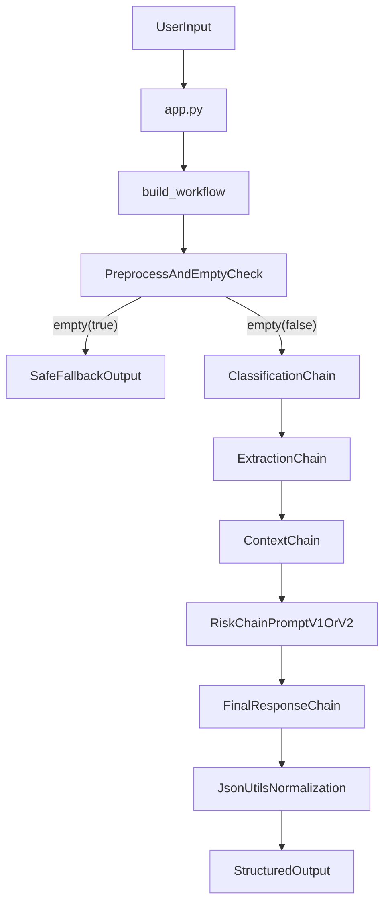

# Project Explanation Guide (Step by Step)

Use this guide as a script to explain the project from start to finish.

## 1) What this project is

This repository is an educational lab that teaches how to build and observe a small multi-step LangChain workflow with LangSmith.

- Main value: tracing, metadata/tags, and evaluation loops.
- The project now includes two equivalent orchestration styles in `chains/workflow.py`:
  - `build_workflow` (default, step-by-step Python)
  - `build_workflow_LCEL` (same logic in LCEL syntax)
- Domain logic is intentionally simple so the focus stays on observability and experimentation.

Start with:

- `README.md` for the high-level overview and commands.
- `PRACTICE.md` for the lab missions and validation checklist.

## 2) Repository orientation (what each folder does)

- `app.py`: CLI entrypoint for running the workflow, creating datasets, and running evaluations.
- `config.py`: environment validation, model setup, and shared `RunnableConfig` metadata/tags.
- `chains/`: core workflow components and orchestration entrypoints.
- `prompts/`: prompt templates (including risk prompt versions).
- `evaluation/`: evaluator functions and helper scripts to run experiments.
- `data/`: fixed examples used to populate the LangSmith dataset.
- `utils/`: output-safety helpers to normalize model JSON fields.

## 3) Setup prerequisites

1. Create and activate a Python virtual environment:
   - `python -m venv .venv`
   - `.venv\Scripts\Activate.ps1`
2. Install dependencies:
   - `pip install -r requirements.txt`
3. Create `.env` from template:
   - `copy .env.example .env`
4. Set required keys in `.env`:
   - `OPENAI_API_KEY`
   - `LANGSMITH_API_KEY`

Important note: `config.py` fails fast if required keys are missing, so setup issues are surfaced early.

## 4) How to run the project (CLI mental model)

All operations are exposed through `app.py`:

- Single request:
  - `python app.py run --message "your request"`
  - legacy equivalent: `python app.py --message "your request"`
- Dataset management:
  - `python app.py dataset`
  - `python app.py dataset --reset`
- Prompt evaluation experiments:
  - `python app.py eval --prompt-version prompt-v1`
  - `python app.py eval --prompt-version prompt-v2`

Helper wrappers in `evaluation/` call the same app functions:

- `evaluation/create_dataset.py`
- `evaluation/run_experiment.py`

## 5) Internal workflow explained in order

The orchestrator is `chains/workflow.py`.

- Default path used by `app.py`: `build_workflow()`
- Alternate educational path: `build_workflow_LCEL()`

### Step A: preprocess and guardrails

- `build_workflow()` strips and validates `user_input` directly in the `run(...)` function.
- Empty input returns `EMPTY_INPUT_RESPONSE`.

### Step B: classification

- `chains/classification_chain.py` classifies request type.
- Output category is normalized with `safe_category(...)`.

### Step C: extraction

- `chains/extraction_chain.py` extracts structured details from input.
- Includes fallback for `missing_fields` shape.

### Step D: context enrichment

- `chains/context_chain.py` maps category to static policy/technical context.

### Step E: risk analysis

- `chains/risk_chain.py` chooses risk prompt by version (`prompt-v1` or `prompt-v2`).
- Produces normalized `risk_level`, `decision`, and `reason`.

### Step F: final response generation

- `chains/final_response_chain.py` generates the user-facing answer text.

### Step G: final schema hardening

- `workflow.py` composes final output schema in the last return block.
- `utils/json_utils.py` enforces safe enum-like values (`category`, `risk_level`, `decision`).

### Optional comparison path (LCEL version)

`build_workflow_LCEL()` in the same file implements the identical stages with LCEL primitives:

- `RunnablePassthrough.assign(...)`
- `RunnableBranch(...)`
- `RunnableLambda(...)`

Use this when teaching how imperative workflow logic maps to LCEL composition.

## 6) Architecture/data flow diagram

## 7) Prompt experimentation and evaluation loop

Prompt versions are selected in `chains/risk_chain.py`, then measured through LangSmith experiments launched via `app.py eval`.

Evaluation logic lives in `evaluation/evaluators.py`:

- `category_match`
- `risk_match`
- `decision_match`
- `no_unsafe_approval`
- `has_reason`

Recommended demo sequence:

1. Run one request with `prompt-v1`.
2. Run the same request with `prompt-v2`.
3. Run full experiments for both versions.
4. Compare traces and evaluator outcomes in LangSmith.

## 8) Extension points (where to modify behavior safely)

- Adjust prompts: edit files in `prompts/` (lowest-risk iteration path).
- Adjust parsing/normalization: update relevant chain in `chains/`.
- Adjust output constraints: edit `utils/json_utils.py`.
- Adjust scoring logic: edit `evaluation/evaluators.py`.
- Adjust tags/metadata and runtime settings: edit `config.py` and app run config calls.

Use this repeatable cycle:

1. Change code or prompt.
2. Run `python app.py run --message "..."`
3. Inspect LangSmith trace tree.
4. Run `python app.py eval --prompt-version ...`
5. Compare evaluator outcomes and decide next iteration.

## 9) Minimal file set to memorize

If you need to explain quickly, focus on these files first:

- `README.md`
- `app.py`
- `config.py`
- `chains/workflow.py`
- `chains/risk_chain.py`
- `evaluation/evaluators.py`
- `utils/json_utils.py`
